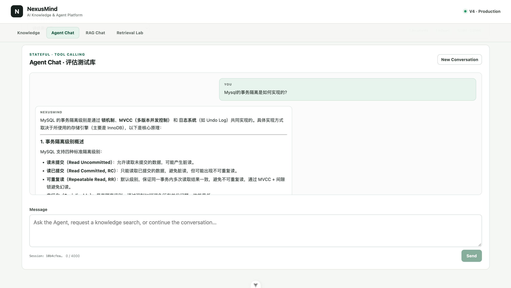
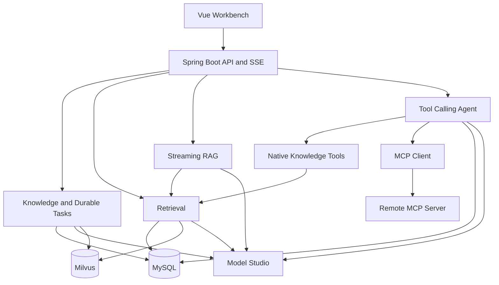

# NexusMind

**Production-Oriented Java AI Knowledge & Agent Platform**

NexusMind 是一个基于 Spring AI 的 Java AI 知识库与 Agent 工程项目，覆盖混合检索、流式 RAG、真实 Function Calling、受控 MCP 工具接入，并针对任务恢复、Provider 短暂故障、并发、上下文预算和可观测性建立了明确边界。

## Why NexusMind

这个项目不是一次 `VectorStore.similaritySearch()` 的包装，而是对 Java AI 应用完整链路的系统性实践：文档如何可靠进入索引、Retrieval 如何评价和演进、模型如何按需调用工具，以及跨 MySQL、Milvus 与外部模型的失败如何被识别和恢复。

项目保留两条可比较的产品路径：

- **Fixed RAG**：`Query → Retrieval → Context → LLM`，路径固定、行为可预测。
- **Agent**：`Query → LLM → decide tool → Tool Result → decide next action`，下一步来自真实模型 `tool_call`，不是 Java 关键词工作流。

## Core Capabilities

### Knowledge & Ingestion

- PDF、Markdown、UTF-8 TXT 上传、解析与字符窗口分块
- MySQL 保存 Knowledge Base、Document、Chunk 等业务事实
- MySQL durable task queue 异步执行 Process / Index
- Worker atomic claim、`runToken` fencing、heartbeat 与 stale recovery

### Retrieval Quality

- `DENSE` 语义检索与 `BM25` 词法检索
- Dense / BM25 并行执行，route visibility validation 后做 Application RRF
- `HYBRID_RERANK` 使用 `qwen3.7-text-rerank` 精排候选
- Golden Dataset、HitRate@K、Recall@K、MRR@K、Latency Evaluation
- Retrieval Lab 展示 score type、route contribution 与 rerank provenance

### RAG & Agent

- SSE Streaming RAG、token-aware context 与模型实际可见 Sources
- `qwen3.5-flash` Function Calling 和 application-controlled Tool Loop
- 原生只读工具：`search_knowledge_base`、`get_document_context`
- Multi-step Tool Chaining、run-scoped Source IDs、Conversation Memory
- 受控 Streamable HTTP MCP Client：启动发现、allowlist、预算和超时边界

### Production Engineering & Observability

- Provider transient failure classification、bounded retry、backoff 与 jitter
- Agent Session DB lease、旧 Run fencing 和 crash expiry
- RAG、Memory、Tool Result 与每次 Model Turn 的 application token budget
- Spring Boot Actuator、Micrometer、Prometheus 与低基数标签策略
- 结构化安全日志：不记录 prompt、chunk 正文、凭据或远程 MCP URL

## Demo



Vue Workbench 由 `Knowledge`、`Agent Chat`、`RAG Chat`、`Retrieval Lab` 四个保留状态的 Tab 组成。

## Architecture



MySQL 是业务 **Source of Truth**；Milvus 是可重建的 **Derived Retrieval Projection**；Document Task 只负责执行协调。详细链路、数据所有权与故障模型见 [Architecture](docs/architecture.md)。

## Retrieval Quality

项目提供四种正式 Retriever：`DENSE`、`BM25`、`HYBRID_RRF`、`HYBRID_RERANK`。30-query、22-page synthetic benchmark 的真实结果如下：

| Strategy | Hit@1 | Hit@5 | Recall@5 | MRR@5 | Avg | P95 |
|---|---:|---:|---:|---:|---:|---:|
| DENSE | 1.0000 | 1.0000 | 1.0000 | 1.0000 | 184.90 ms | 199 ms |
| BM25 | 1.0000 | 1.0000 | 1.0000 | 1.0000 | 20.83 ms | 21 ms |
| HYBRID_RRF | 1.0000 | 1.0000 | 1.0000 | 1.0000 | 201.27 ms | 212 ms |
| HYBRID_RERANK | 1.0000 | 1.0000 | 1.0000 | 1.0000 | 445.30 ms | 715 ms |

这个小型、知识边界清晰的 Dataset 已出现 **ceiling effect**。它证明四条 Pipeline 和统一评估框架能够正确工作，但不能证明 Hybrid 或 Rerank 在复杂真实 Corpus 上显著优于 Dense。由于额外 latency、外部依赖和费用尚未换来可测质量收益，产品默认 Retriever 保持 `DENSE`。完整分析见 [V2 Retrieval Quality](docs/v2-retrieval-quality.md)。

## Agent & MCP

Agent 先由模型判断是否需要工具，再把 Tool Result 送回模型决定下一步。知识检索可能只调用一次 `search_knowledge_base`，也可能继续调用 `get_document_context(S1)`；Java 层没有固定 Search → Context 流程。

MCP 工具和原生工具进入同一个 Tool Catalog 与 Guardrail。NexusMind 当前只消费受信任、显式配置的 Streamable HTTP MCP Tools；工具经过启动发现、名称规范化和 allowlist 后才会暴露给模型。LLM 不直接访问 MCP Server。

## Production Engineering

| Theme | Implementation |
|---|---|
| Durability | MySQL durable document tasks、at-least-once execution、幂等 Process / Index、业务状态对账 |
| Resilience | Provider transient failure bounded retry；产生可观察流式输出后不重放 |
| Concurrency | Parallel Dense/BM25；Agent Session DB lease；`runId` / `runToken` fencing |
| Context Control | RAG rank-prefix、Memory whole-turn eviction、Tool per-call/per-run budgets |
| Observability | Actuator health/info/prometheus、`nexusmind.*` metrics、安全结构化日志 |

## Tech Stack

| Area | Stack |
|---|---|
| Backend | Java 17, Spring Boot 4.1.0, Spring AI 2.0.1, Spring MVC, MyBatis 4.1.0 |
| AI | `qwen3.5-flash`, `qwen3.7-text-embedding-flash`, `qwen3.7-text-rerank` |
| Storage | MySQL 8.4, Milvus 2.6 |
| Frontend | Vue 3, TypeScript, Vite, Vitest |
| Engineering | Flyway, Micrometer, Prometheus, MCP Streamable HTTP |

## Quick Start

### Requirements

- Java 17
- Node.js `^22.18.0` 或 `>=24.12.0`
- Docker 与 Docker Compose
- Alibaba Cloud Model Studio workspace-compatible API 地址和本地 API Key

### 1. Configure local environment

```bash
cp deploy/.env.example deploy/.env
```

在未跟踪的 `deploy/.env` 中填写本地 MySQL 密码、`DASHSCOPE_API_KEY`、`CHAT_BASE_URL`、`EMBEDDING_BASE_URL`；使用 Rerank 时再配置 `RERANK_BASE_URL`。不要提交该文件。

### 2. Start infrastructure

```bash
cd deploy
docker compose up -d
docker compose ps
```

该 Compose 只启动 MySQL、Milvus、etcd 与 MinIO，**不启动 NexusMind Backend 或 Web**。

### 3. Start backend

```bash
cd nexusmind-server
set -a
source ../deploy/.env
set +a
./mvnw spring-boot:run -Dspring-boot.run.profiles=local
```

Backend 默认监听 `http://localhost:8080`，Flyway 会管理 MySQL Schema。

### 4. Start frontend

```bash
cd nexusmind-web
npm ci
npm run dev
```

打开 Vite 输出的地址。开发服务器会把 `/api` 代理到本地 Backend。

## Demo Scenarios

1. **Knowledge**：Upload → async Process → async Index，观察 durable task 状态。
2. **Retrieval Lab**：对同一 Query 比较 Dense、BM25、RRF、Rerank 的 rank、score 与 provenance。
3. **RAG / Agent**：对比固定 Retrieval → Context → LLM 与模型驱动 Search → Context Tool Chaining。
4. **External MCP**：配置可信 Streamable HTTP MCP Server，展示 allowlisted external tool 进入同一 Agent Loop。

## Evaluation

- **Retrieval Evaluation**：HitRate@K、Recall@K、MRR@K 和端到端 Retrieval latency；使用固定 Golden Dataset 比较四种 Retriever。
- **Agent Behavior Evaluation**：检查 tool selection、tool sequence、completion、unexpected calls 和 session continuity，不使用 LLM-as-a-Judge，也不声称自然语言答案质量达到 100%。

Dataset、CLI 与报告格式见 [Retrieval Evaluation](docs/retrieval-evaluation.md) 和 [V3 Agent](docs/v3-agent.md)。真实模型评估需要用户显式执行，默认测试不会调用收费服务。

## Engineering Decisions

- MySQL 保存业务事实，Milvus 仅保存可重建检索投影。
- Dense/BM25 raw score 不直接相加；各路完成业务可见性校验后按 rank 做 RRF。
- Agent Tool Loop 由应用控制 guardrail，但下一步工具来自模型真实 `tool_call`。
- Source ID 只在一个 Agent Run 内有效；跨请求只保存 User 与 Final Assistant。
- 当前单体使用 MySQL durable queue 和 DB lease，避免过早引入 MQ 或 JVM-only lock。
- Provider context window 不等于应用预算；NexusMind 使用保守的本地 token estimate 和 safety margin。

更多取舍见 [Project Overview](docs/project-overview.md) 与 [Architecture](docs/architecture.md)。

## Project Evolution

- **V1 Basic RAG**：打通 Document → Chunk → Embedding → Retrieval → grounded streaming answer。
- **V2 Retrieval Quality**：让 Retrieval 可评价，并从 Dense 扩展到 BM25、RRF、Rerank。
- **V3 Agent**：从固定 Pipeline 进入 model-driven tool calling、multi-tool 与 conversation memory。
- **V4 Production Engineering**：处理 durable execution、failure、concurrency、context、MCP 与 observability。

V1–V4 已完成并冻结；NexusMind 不继续规划新的功能版本。

## Project Structure

```text
nexusmind/
├── nexusmind-server/   # Spring Boot backend
├── nexusmind-web/      # Vue Workbench
├── deploy/             # Local MySQL and Milvus infrastructure
├── docs/               # Architecture and feature design notes
└── evaluation/         # Retrieval and Agent behavior datasets
```

## Known Limitations

- Qwen token 数量使用本地 estimator 近似，不是官方 tokenizer 精确值。
- 没有 Provider circuit breaker 或 alternate-provider fallback。
- MCP 仅支持受控的 Streamable HTTP Tools，无 OAuth、Resources 或 Prompts。
- Streaming 与 Tool cancellation 是 best effort。
- Durable Task 使用 MySQL queue，而不是独立分布式消息系统。
- Conversation Memory 不提供长期 semantic memory。

这些是项目边界，不是隐藏的能力声明或新的 Roadmap。

## Documentation

- [Project Overview](docs/project-overview.md)
- [Architecture](docs/architecture.md)
- [Demo Guide](docs/demo-guide.md)
- [V1 Demo](docs/v1-demo.md)
- [V2 Retrieval Quality](docs/v2-retrieval-quality.md)
- [V3 Agent](docs/v3-agent.md)
- [Retrieval Evaluation](docs/retrieval-evaluation.md)
- [Async Document Tasks](docs/async-document-tasks.md)
- [Resilience and Concurrency](docs/resilience-concurrency.md)
- [Token and Context Management](docs/token-context-management.md)
- [Controlled MCP Client](docs/mcp-client-integration.md)
- [Observability](docs/observability.md)
