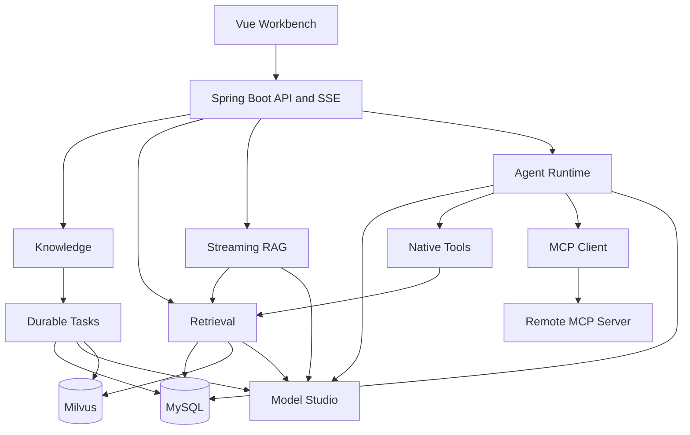
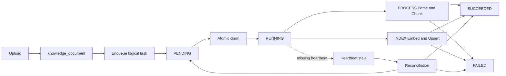
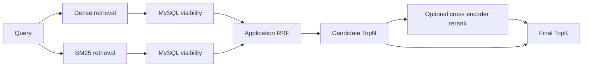
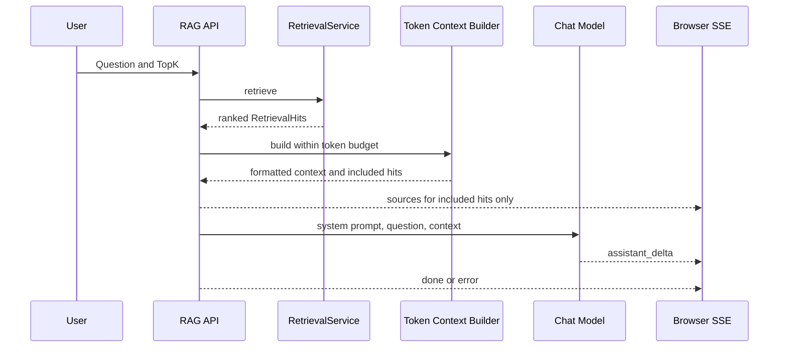
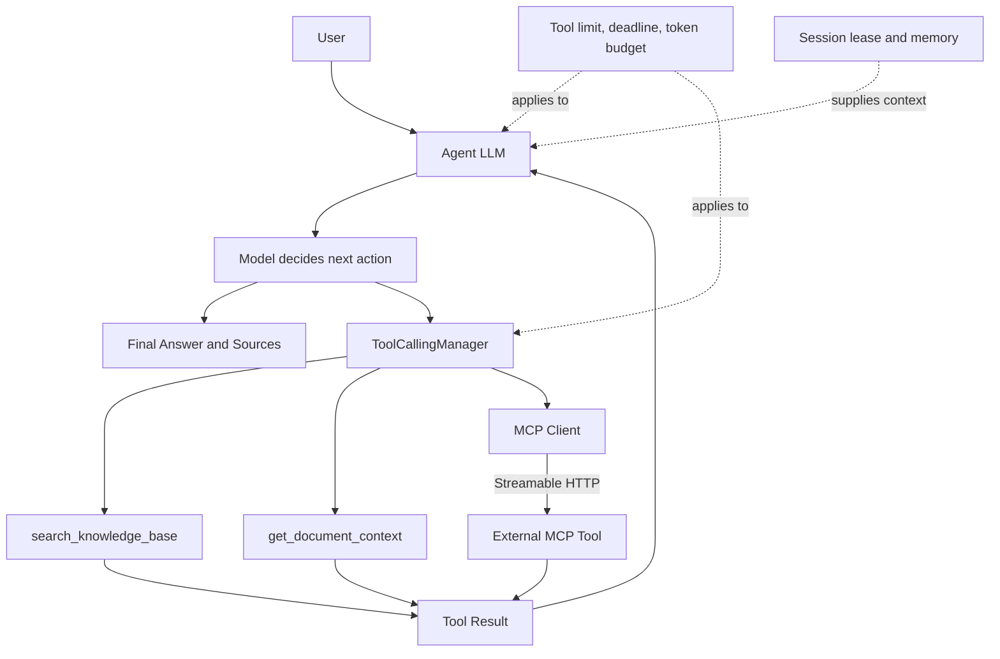
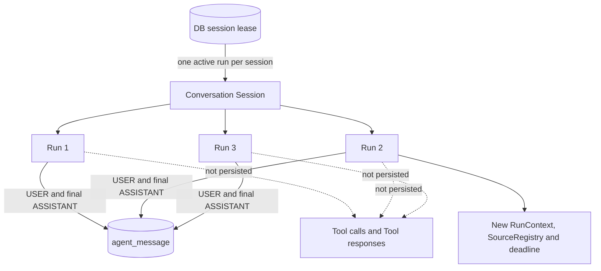

# NexusMind Architecture

本文以当前 V4 冻结代码为准，说明 NexusMind 的运行边界、数据所有权、核心 Pipeline 和故障模型。正文以中文为主，保留 Source of Truth、Projection、Tool Calling 等关键技术术语。

## 1. System Overview

NexusMind 是一个单体 Spring Boot 应用和 Vue Workbench。它同时保留固定 RAG 与 Agent 两条路径：RAG 提供可预测的 Retrieval → Context → LLM；Agent 让模型通过真实 `tool_call` 决定是否使用知识工具或外部 MCP Tool。



系统的核心边界是：MySQL 保存业务事实，Milvus 保存可重建的检索投影，外部模型和 MCP Server 都位于不可信的网络边界之外。

## 2. Knowledge Ingestion

文档上传支持 PDF、Markdown 与 UTF-8 TXT。Upload 只保存原始文件和 `knowledge_document`，不会自动 Process；Process 负责 Parser、字符窗口 Chunking 和 MySQL Chunk 持久化；Index 再读取当前 Chunk，调用 `qwen3.7-text-embedding-flash` 并写入 Milvus。

默认 Chunk 参数为 500 chars、100 chars overlap。V4 的 token budget 控制 Prompt Context，不改变 ingestion chunking。Process 与 Index 是两个独立、由用户显式触发的动作。

## 3. Durable Document Tasks

Process / Index 不在 HTTP Request 内执行。Controller 先在短事务中持久化 `knowledge_document_task`，成功提交后返回 `202 Accepted`；后台 Worker 再认领任务。



关键设计：

- `(document_id, task_type)` 是逻辑任务唯一键；重复 enqueue 复用同一行。
- Worker 使用 `FOR UPDATE SKIP LOCKED` 做短事务 atomic claim，默认并发为 2。
- 每次 claim 生成新的 `runToken`；heartbeat、success、failure 更新都必须匹配当前 token。
- 默认 heartbeat 为 10 秒、stale threshold 为 5 分钟、recovery scan 为 30 秒。
- Recovery 先检查 Document 业务状态。Document 已 `READY` 或 `INDEXED` 时直接把 stale Task 对账为 `SUCCEEDED`，而不是盲目重做。
- Process 事务化替换整份 Chunk；Index 以稳定 `chunkId` upsert Milvus，因此重复执行最终收敛。

该模型是 **durable DB task + at-least-once execution + idempotent operation + reconciliation**，不声称 exactly-once。`runToken` 能防止旧 Worker 覆盖新任务所有者，但不能撤销已经发生的外部副作用。

## 4. Retrieval Pipeline

四种正式 Retriever 为 `DENSE`、`BM25`、`HYBRID_RRF`、`HYBRID_RERANK`。Hybrid 的两条 route 在专用有界 Executor 上并行执行，但每一路都先完成 MySQL visibility validation，只有 READY、INDEXED、属于当前 KB 的 Chunk 才会参与 Application RRF。



RRF 只使用 1-based rank：

```text
RRF(d) = Σ 1 / (k + rank_i(d)), k = 60
```

COSINE 与 BM25 raw score 不在同一尺度，不参与融合计算。默认 route candidate depth 由 multiplier/min/max policy 计算；Rerank 默认接收 Hybrid Top20，并按 Provider 返回的 index 映射回原始 `RetrievalHit`。上游 Dense/BM25 contribution、RRF rank 与 score 会作为 provenance 保留。

任一路异常会令整个 Hybrid 失败；某一路返回空列表则是合法结果。产品默认 Retriever 仍为 `DENSE`，因为当前 benchmark 已饱和，没有实验依据证明更高 latency 和成本应成为默认路径。

## 5. RAG Pipeline

固定 RAG 通过配置选择 `RetrievalService`，按 rank prefix 构建 token-aware Context。系统只把模型实际看到的 Sources 返回给浏览器。



完整 Source Block（citation、文件名、页码、section、content）一起计入预算。正常情况下按 rank 加入完整 Chunk；第一个 Source 单独超限时只截断其 content 并保留 citation metadata。System Prompt 与当前 Question 已超过有效预算时，返回 `RAG_CONTEXT_BUDGET_EXCEEDED`，不会调用模型，也不会静默截断用户问题。

## 6. Agent Runtime and MCP Integration

Agent 使用 application-controlled Tool Loop：应用负责 Tool Schema、计数、deadline、SSE 和安全边界，模型负责通过真实 `tool_call` 决定下一步。不存在固定的 Search → Context → MCP Java Workflow。



原生知识工具的模型可见参数保持最小：

- `search_knowledge_base(query)` 发现当前 KB 中的相关 Source。
- `get_document_context(sourceId)` 只接受本 Run 已注册的 Source ID，并读取同 Document 的相邻 Chunk。

MCP 默认关闭。启用后由 Spring AI Streamable HTTP Client 在启动期发现工具，NexusMind 对最终名称做规范化和 allowlist 筛选，再把允许的 Callback 合入同一个 Tool Catalog。LLM 从不直接请求 MCP Server；远程 description、schema 与 result 都按外部不可信数据处理。当前只消费 MCP Tools，不支持 MCP Resources、Prompts、OAuth 或热更新。

每个 Agent Run 最多 5 次 Tool invocation，共享一个 30 秒 absolute deadline。MCP invocation 与原生工具使用同一个 Tool Limit 和 per-run Tool Result Budget。

## 7. Conversation Memory and Session Concurrency

Session 跨多个 HTTP Request；Run 只代表一次 Request。每个 Run 都会重新创建 `AgentRunContext`、`AgentSourceRegistry`、deadline、tool counter 和 run token budget。



MySQL 只持久化成功 Turn 的 `USER` 和 Final `ASSISTANT`，不保存 System Prompt、Tool Call、Tool Response 或 SSE Trace。失败、超时、Tool Limit、Lease Lost 和 Memory Commit 失败的 Run 不写入当前 Turn。

`S1`、`S2` 等 Source ID 只在一个 Run 内有效。历史 Assistant 文本在数据库中保持原样，但注入下一轮 Prompt 前会移除旧 `[S<number>]` 标记。当前 Run 的 Citation 会与 `AgentSourceRegistry` 校验；无效引用只记录 metric 和 warning，不重写已经流式输出的回答。

Session concurrency 使用 MySQL DB-time lease，而不是 JVM Lock 或长事务行锁。`runId` 是 lease owner；release 和 successful memory commit 都必须匹配 owner。进程崩溃后 lease 到期，新 Run 才能获得 Session。

## 8. Token and Context Management

Provider 的最大 Context Window 不等于应用预算。NexusMind 使用本地 `NexusTokenEstimator` 做保守估算，它并非 Qwen 官方 tokenizer，因此通过 safety margin 吸收 tokenizer mismatch 和序列化开销。

默认全局 policy：

| Setting | Value |
|---|---:|
| `max-context-tokens` | 32768 |
| `reserved-output-tokens` | 4096 |
| `safety-margin-tokens` | 4096 |
| `tool-definition-reserve-tokens` | 4096 |
| RAG context max | 12000 |
| Memory max | 12 messages / 6000 tokens |
| Tool result max | 5000 per call / 12000 per run |

Memory 同时受 message count 和 token 限制，超限时从最旧的完整 User/Assistant Turn 开始淘汰，不删除数据库历史，也不截断当前 User。Search Tool 按 retrieval rank prefix 选择结果；Document Context Tool 优先保留 target Source。每次模型调用前仍执行最终预算校验，超限时返回 `AGENT_CONTEXT_BUDGET_EXCEEDED`，不调用 Provider。

## 9. Data Ownership

| Component | Responsibility | Not responsible for |
|---|---|---|
| MySQL `knowledge_*` | KB、Document、Chunk 业务 Source of Truth | 向量相似度检索 |
| Milvus | 可重建 Dense/BM25 Retrieval Projection | Document 业务状态判定 |
| `knowledge_document_task` | Durable execution coordination | 代替 Document/Chunk 业务事实 |
| `agent_session` / `agent_message` | Cross-request conversation outcome | 当前 Run Tool Trace |
| `AgentRunContext` | 单次 Run 的 deadline、计数、Source 和预算 | Session 长期持久化 |
| Remote MCP Server | 外部能力实现 | NexusMind 本地策略与授权 |

这个划分解释了为什么 Retrieval 要回到 MySQL 做 visibility validation，也解释了为什么 stale task recovery 先读取 Document 业务状态。

## 10. Failure Model

| Failure | Behavior |
|---|---|
| Provider timeout、network、408、429、5xx | 有界 retry、exponential backoff 和 jitter |
| Provider 400、401、403、404 或非法配置 | 立即失败，不重试 |
| Streaming 已输出 delta 或已开始 Tool | 失败，不重放当前 Turn |
| Hybrid 任一路异常 | 整个 Hybrid 失败，不静默降级 |
| Document Worker crash | Heartbeat stale 后做业务状态 reconciliation |
| 同 Session 并发请求 | DB lease 只允许一个 active Run |
| 旧 Run 恢复执行 | Fenced release 与 memory commit 阻止覆盖新 Owner |
| Context 超预算 | Provider 调用前确定性失败 |
| MCP timeout / protocol / remote error | `tool_error → error`，不自动 retry |

Embedding 失败后不会 fallback 到另一模型，因为混合向量空间会污染 Milvus。Rerank 失败后也不会假装返回已经精排的结果。

## 11. Observability

Actuator 只暴露 `health`、`info`、`prometheus`。Micrometer 应用指标统一使用 `nexusmind.*`，覆盖 RAG、Retrieval、Provider、Agent、Tool、MCP、Document Task、Context Budget、Session Lease 与 Citation。

指标标签只允许 retriever、outcome、operation、failureCategory、taskType、toolType 等低基数枚举。runId、sessionId、documentId、query、动态 MCP tool name 和 remote URL 不进入 tag。日志保留执行身份、duration 与 outcome，但不记录 prompt、conversation history、chunk body、tool result、Authorization 或 API key。

NexusMind 提供可抓取的 Prometheus surface，但不捆绑 Grafana、OpenTelemetry Collector、Tracing Backend 或集中式日志系统。

## 12. Package Boundaries

后端采用 **feature-first, layer-second**：

- `knowledge`：API、Document domain/service、parser/chunk/storage、durable task。
- `rag`：Retrieval、Milvus、Embedding、Rerank、Evaluation、RAG API/stream。
- `agent`：Application loop、tool、memory、prompt、stream、MCP、evaluation。
- `context`：共享 Token Estimator、Calculator 与 Text Truncator。
- `resilience`：Provider Failure Classification 与 Retry boundary。
- `observability`：Micrometer facade 和 Health contributor。

MyBatis Entity/Mapper 属于 persistence infrastructure，Domain 表示业务状态和规则。项目没有为了形式创建 AggregateRoot、CommandBus 或无实际职责的 Repository Port。

## 13. Key Engineering Decisions

| Decision | Why | Alternative / Trade-off |
|---|---|---|
| MySQL 是 Source of Truth，Milvus 是 Projection | 业务可见性和状态需要事务事实；向量索引可重建 | Retrieval 需要额外 visibility reconciliation |
| Application RRF | 保证每一路先完成业务过滤，并保留 route provenance | 比 Milvus native hybrid 多一层应用编排 |
| 默认 RAG 使用 Dense | 当前 benchmark 已饱和，高级路径没有可测默认收益 | 真实复杂 Corpus 可能需要 Hybrid/Rerank |
| Application-controlled Tool Loop | 能发布稳定 SSE 并强制 Tool Limit、deadline、budget | 比框架全自动 Tool Loop 多一些 orchestration |
| Run-scoped Source IDs | 不向模型暴露 Chunk/Document 内部 ID | Source ID 不能跨 Run 复用 |
| 仅保存 User + Final Assistant | Memory 保存 conversation outcome，不保存 execution trace | 后续问题需要时会重新调用工具 |
| MySQL durable task queue | 单体已依赖 MySQL，可获得 durability、claim、recovery | 不适合替代独立大规模分布式 MQ |
| DB session lease | 多实例可见，避免 30 秒长事务锁 | Lease expiry 带来有限恢复窗口 |
| Application token budget | 控制 latency、cost 和不可预测 Tool Loop 增长 | 本地估算不是 Qwen 精确 token 数 |
| Controlled remote MCP | 工具需启动发现、命名和 allowlist 后才可见 | 不提供用户任意注册、OAuth 或动态热更新 |

## 14. Design Trade-offs and Boundaries

NexusMind 是个人 engineering project，不声称具备完整高可用或大规模生产基础设施。当前明确边界包括：没有 Provider circuit breaker/fallback，没有长期 semantic memory，MCP 仅支持受控 Streamable HTTP Tools，cancellation 为 best effort，Durable Task 使用 MySQL 而非分布式 MQ，也没有内置 Grafana/OTel stack 或 multi-agent。

这些限制用于界定项目范围，而不是继续扩展功能的 Roadmap。V1–V4 已冻结。
